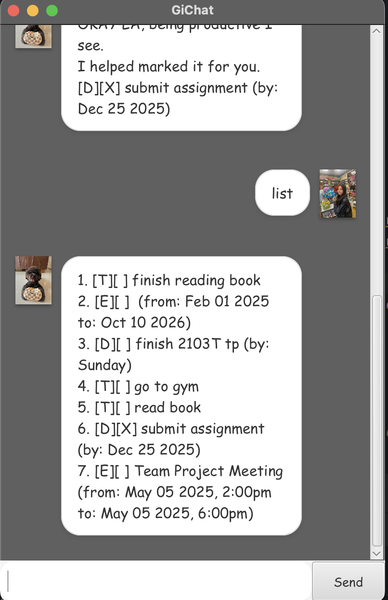

# GiChat User Guide

GiChat is an all-in-one task management chatbot that helps you organise your todos,
deadlines and events with a friendly Singaporean twist. Keep track of your tasks 
through simple commands and let GiChat handle the rest



GiChat stores your tasks automatically and provides witty responses to keep task
management entertaining. Whether you're juggling assignments, meetings or personal
reminders, GiChat has got you covered with its intuitive command system.

## Adding Todo Tasks

Add simple tasks without any time constraints using the `todo` command.

Example: `todo read book`


```
Roger, added the task
    [T][] read book
Jialat, you have 1 task in your list
```

## Adding Deadline Tasks

Add tasks with specific deadlines using the `deadline` commands with the /by
parameter.

Example: `deadline submit assignment /by 2025-12-25`

```
Roger, added the task
    [D][] submit assignemnt (by: Dec 25 2025)
Jialat, you have 2 tasks in your list
```


## Adding Event Tasks

Add events with start and end times using the `event` commands with /from and /to parameters.

Example: `event Team Project Meeting /from 2025-05-05 1400 /to 2025-05-05 1800`

``` 
Roger, added the task
    [E][] event Team Project Meeting (from: May 05 2025 2:00pm to: May 05 2025 6:00pm)
Jialat, you have 3 tasks in your list
```


## Listing All Tasks
View all your current tasks using the `list` command

Example: `list`

```
1. [T][ ] read book
2. [D][ ] submit assignment (by: Dec 25 2025)
3. [E][ ] Team Project Meeting (from: May 05 2025, 2:00PM to: May 05 2025, 6:00PM)
```


## Marking Tasks Done
Mark completed tasks using the `mark` command follwed by the task number

Example: `mark 1`

```
OKAY LA, being productive I see.
I helped marked it for you.
[T][X] read book
```

## Unmakring Tasks
Unmarking tasks using the `unmark` command followed by the task number

Example: `unmark 1`

``` 
oh... I have unchecked the task for you lazy bum
```

## Deleting Tasks
Remove tasks from your list using the `delete` command followed by the task number

Example: `delete 2`

``` 
Orh, I removed the task 
[D][ ] submit assignment (by: Dec 25 2025)
Now you are left with 2 tasks in your list
```

## Finding Tasks
Search for tasks containing specific keywords using the `find` command

Example: `find meeting`

``` 
These are the tasks I could find
1.[E][ ] Team Project Meeting (from: May 05 2025, 2:00PM to: May 05 2025, 6:00PM)
```


## Editing Tasks 
Modify existing tasks using the `edit` command with various parameters

* `/desc`- change description
* `by` - change deadline (for deadline tasks)
* `/from` - change start time (for event tasks)
* `/to` - change end time (for event tasks)

Example: `edit 1 /desc finish reading book`

```
Roger, I updated the task
Old: [T][] raed book
New: [T][] finish reading book
```

## Exiting GiChat
Save your tasks and exit using the bye command

Example: `bye`

```
Bye, don't come back soon
```


## Notes
* Task numbers start from 1 and correspond to the order shown in the `list` command
* Dates should be in yyyy-MM-dd format
* Time should be in HHmm format (24-Hour)
* All tasks are automatically saved to a file and will persist between sessions
* GiChat will validate that event start times comes before event end times